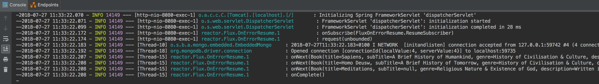
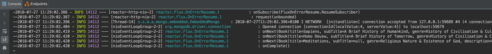

# example-spring-boot-2.x-service
creating a simple Spring-boot 2.X service to compare with different frameworks

A simple service with one endpoint GET /books. 

`curl -X GET http://localhost:8080/books`

### stack
- Spring Boot 2.X
- Spring WebFlux
- Reactive Spring Data - Mongo
- Embedded MongoDB 
- Lombok

### Spring Boot 2.X features
* event-loop execution model:
    - asynchronous and non-blocking
    - thread pool can be smaller than Spring Boot 1.5.X
    - see previous commits for the migration and how the threading model changes
        - Spring MVC + Reactive Spring Data, mixed model, Spring will marshal between threads
        - Spring WebFlux + Reactive Spring Data, completely none-blocking
* Reactive stack:
    - Spring WebFlux (non-blocking reactive alternative web framework to Spring MVC. uses Netty by default)
    - Reactive Spring Data (where the DB supports e.g. spring-boot-starter-data-mongodb-reactive)
    - Netty, Servlet 3.1 (async runtime)
* notes:
    - support for _Reactive Streams API_
    - motivation is scalability
    - relational DBs currently cannot be reactive
    - JPA currently only blocking

_fig.1 Spring MVC + Reactive Spring Data_ : mixed model

_fig.2 webFlux + Reactive Spring Data_ : fully reactive

### TODO
not using "routes" functional API in Spring Boot 2.x. similar to NodeJs and Akka style. Not mandatory for this example. 