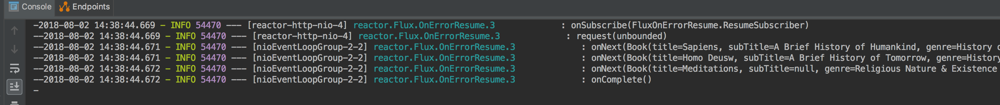

# example-spring-boot-2.x-service
A simple Spring-boot 2.X service to compare with various backend technologies.

Blog post: [comparing execution model of various backend technologies](https://ioflyingnimbus.blogspot.com/2018/08/comparing-execution-model-of-various.html)

A single endpoint which retrieves data from a Mongo

`curl -X GET http://localhost:8080/books`

**Stack:**
- Spring Boot 2.X
- Spring WebFlux
- Reactive Spring Data - Mongo

### Setup Mongo

You can use the embedded Mongo buy uncommenting **de.flapdoodle.embed** the dependency in the pom.xml.

You can also easily setup a local Mongo running from a local [Docker](https://www.docker.com/docker-mac) image. Pull the [Mongo image](https://hub.docker.com/_/mongo/) and run remembering to use the **-p** option to the port. e.g:

`docker run -p 27017:27017 --name some-mongo mongo`

### Spring Boot 2.X features
* event-loop execution model:
    - asynchronous and non-blocking IO
    - thread pool can be smaller than Spring Boot 1.5.X
    - see previous commits for the migration and how the threading model changes
        - Spring MVC + Reactive Spring Data, mixed model, Spring will marshal between threads
        - Spring WebFlux + Reactive Spring Data, completely none-blocking
* Reactive stack:
    - Spring WebFlux (non-blocking reactive alternative web framework to Spring MVC. uses Netty by default)
    - Reactive Spring Data (where the DB supports e.g. spring-boot-starter-data-mongodb-reactive)
    - Netty, Servlet 3.1 (async runtime)
* notes:
    - support for Reactive Streams API
    - motivation is scalability
    - relational DBs currently cannot be reactive
    - JPA currently only blocking
    - interesting reading on [applicability of webFlux or MVC](https://docs.spring.io/spring/docs/current/spring-framework-reference/web-reactive.html#webflux-framework-choice), many situations precludes using it.

_fig.1 Spring MVC + Reactive Spring Data_ : mixed model

_fig.2 webFlux (controllers API) + Reactive Spring Data_ : fully reactive
